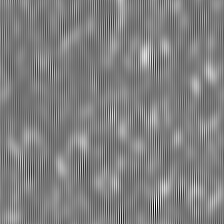
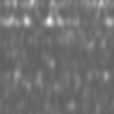
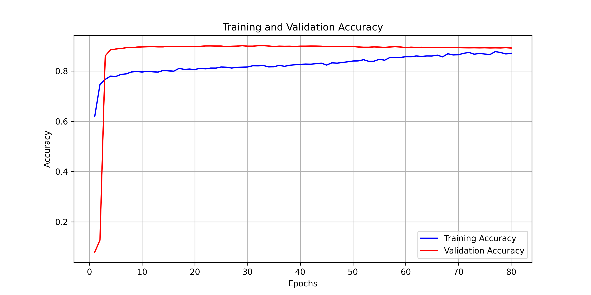
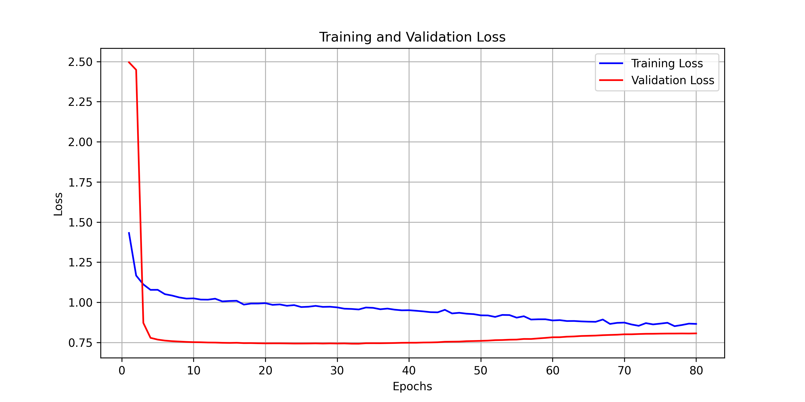
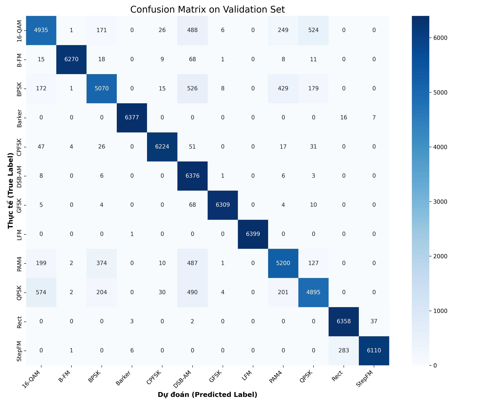

## ⚙️ Installation & Configuration

### Prerequisites
Before you begin, ensure you have the following installed:
- **Python** 3.8 or higher
- **Anaconda** or **Miniconda** (highly recommended for environment management)
- **Git**

### Environment Setup

1. **Clone the repository:**
   ```bash
   git clone [https://github.com/PhuocPham200905/DeepLearning-Radar-Signal-Classification.git](https://github.com/PhuocPham200905/DeepLearning-Radar-Signal-Classification.git)
   cd DeepLearning-Radar-Signal-Classification
   ```

2. **Create and activate a virtual environment:**
   ```bash
   conda create -n radar-dl python=3.10 -y
   conda activate radar-dl
   ```

3. **Install dependencies:**
   *(Assuming you have a `requirements.txt` file. If not, you will need to install libraries like `torch`, `torchvision`, `numpy`, `matplotlib`, etc., manually).*
   ```bash
   pip install -r requirements.txt
   ```

---

## 📊 Dataset Setup

This project utilizes the **Radar & Communication Signal Data 2026** dataset.

**Dataset Link:** [Kaggle - radarcommunsignaldata2026train](https://www.kaggle.com/datasets/huynhthethien/radarcommunsignaldata2026train)

### Option 1: Manual Download
1. Visit the Kaggle link above.
2. Click the **Download** button.
3. Extract the downloaded `.zip` file.
4. Move the extracted data into a `data/raw/` directory within this project.

### Option 2: Download via Kaggle CLI (Recommended)
If you prefer using the command line, you can download the dataset directly using the Kaggle API.

1. **Install the Kaggle library:**
   ```bash
   pip install kaggle
   ```
2. **Authenticate:** Ensure your `kaggle.json` API key is placed in the correct directory:
   - **Linux/Mac:** `~/.kaggle/kaggle.json`
   - **Windows:** `C:\Users\<Your-Username>\.kaggle\kaggle.json`
   
   *(Make sure to change the permissions of the file on Linux/Mac: `chmod 600 ~/.kaggle/kaggle.json`)*

3. **Download and extract the dataset:**
   Run the following commands from the root of your project directory:
   ```bash
   # Create a directory for the dataset
   mkdir -p data/raw
   cd data/raw

   # Download the dataset
   kaggle datasets download -d huynhthethien/radarcommunsignaldata2026train

   # Unzip the downloaded file (Linux/Mac)
   unzip radarcommunsignaldata2026train.zip
   
   # Return to the root directory
   cd ../..
   ```

### Expected Directory Structure
After downloading and extracting, your project structure should look similar to this before you start the training pipeline:

```text
DeepLearning-Radar-Signal-Classification/
├── data/
│   └── raw/
│       └── (extracted dataset folders/files go here)
├── models/
├── notebooks/
├── train.py
├── README.md
└── requirements.txt
```

---

## 🚀 Running the Project
Once the environment is configured and the dataset is placed in the `data/raw` folder, you can configure your training scripts (e.g., updating paths in your config file) and begin training the CNN model.
## 🧠 Model Architecture

The custom CNN architecture is designed to be highly efficient (<100k parameters) while extracting robust spatial features from spectrograms. 
---

## 🖼️ Spectrogram Data Examples

Raw 1D RF signals are converted into 2D spectrograms for the CNN to process. Here are examples of different signal modulations:

<div align="center">
  
  
</div>

---

## 📊 Results & Performance

The model achieved an **Overall Accuracy of 91.83%** on the validation set, demonstrating strong generalization capabilities across various modulation schemes.

### Training & Validation Curves
The learning curves indicate stable convergence without significant overfitting, thanks to robust data augmentation and learning rate scheduling.

<div align="center">
  
  
</div>

### Evaluation Metrics
Detailed precision, recall, and f1-scores across all signal classes:


### Confusion Matrix
The confusion matrix highlights the model's precise classification capabilities and reveals specific areas of minor misclassification between closely related signal types.

<div align="center">
  
</div>
